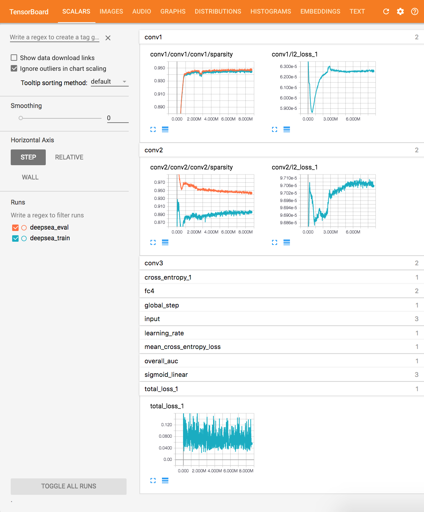
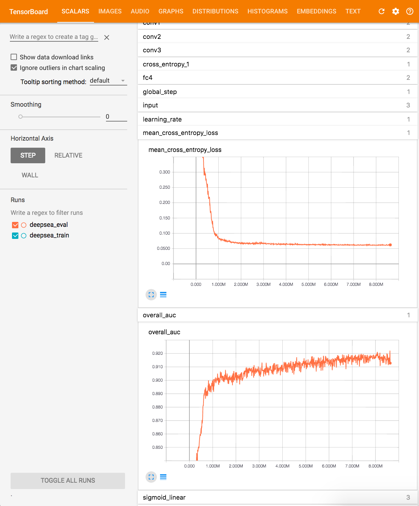
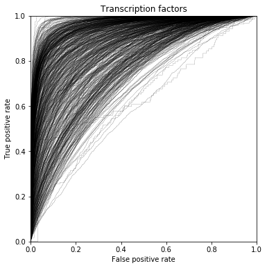
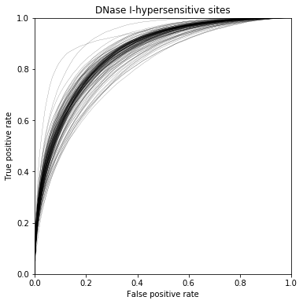
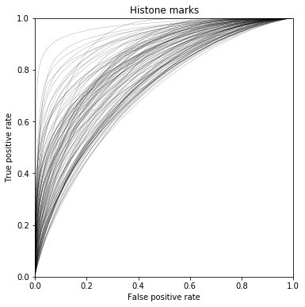

# deepsea

This is a TensorFlow implementation of [DeepSEA](http://www.nature.com/nmeth/journal/v12/n10/full/nmeth.3547.html), a deep learning model for predicting chromatin effects from sequence data. Please refer to the DeepSEA [website](http://deepsea.princeton.edu/job/analysis/create/) for more details. After ~8 million training steps (about 10 days on a  GTX 1070), this implementation attains test set median AUCs of 0.899 for transcription factors, 0.862 for DNase I-hypersensitive sites, and 0.811 for histone marks.

## Requirements

- python 2.7
- [tensorflow 1.0](https://github.com/tensorflow/tensorflow/tree/r1.0)
- h5py
- numpy
- scipy
- sklearn

## Overview

 File | Purpose
------|--------
[`build_data.py`](build_data.py) | Data preparation
[`deepsea_input.py`](deepsea_input.py) | Multithreaded data loading and data batch creation
[`deepsea_model.py`](deepsea_model.py) | DeepSEA model building
[`deepsea_train.py`](deepsea_train.py) | Model training
[`deepsea_eval.py`](deepsea_eval.py) | Model evaluation on val and test sets
[`compute_aucs.py`](compute_aucs.py) | Computation of individual AUCs for all 919 chromatin features
[`plot_roc_curves.ipynb`](plot_roc_curves.ipynb) | Plotting of ROC curves for the three categories of chromatin features

## Usage

### Data Preparation

This model trains on the same [data](http://deepsea.princeton.edu/help/) as the original DeepSEA implementation. The following command will automatically download the data and convert it to the standard TensorFlow TFRecord format.

```bash
python build_data.py
```

Using the TFRecord format allows us to use native TensorFlow data readers and queue runners to optimize the data pipeline. Verify that the data files `train.tfrecord-00000-of-01000` through `train.tfrecord-00999-of-01000`, `val.tfrecord`, and `test.tfrecord` were created. The validation and test sets labels are also converted to numpy format and written to `val.npy` and `test.npy` for faster reading when computing AUCs for trained models.

### Training and Validation

The training script only handles training of the model. In this setup, a separate evaluation script is used to continuously read model checkpoints and run them on the validation set. Model checkpoints are saved every 10000 steps. The `--eval_interval_secs` flag in the evaluation script should be configured to match the amount of time between checkpoint writes.

The following command begins training of the model. The `CUDA_VISIBLE_DEVICES` environment variable specifies the device ID of the GPU to use.

```bash
CUDA_VISIBLE_DEVICES=0 python deepsea_train.py
```

The training script should process about 160 training examples per second on a GTX 1070. If training is interrupted, the same command will automatically resume training from the last checkpoint. To restart training from scratch, delete the `deepsea_train` and `deepsea_eval` directories.

The evaluation script should be run in tandem with the training script. The `CUDA_VISIBLE_DEVICES` environment variable can be used to specify whether to run evaluation on a GPU or on the CPU. If interrupted, the evaluation script will automatically resume from the most recent training checkpoint upon restart.

```bash
# same gpu as training
CUDA_VISIBLE_DEVICES=0 TF_CPP_MIN_LOG_LEVEL=3 python deepsea_eval.py

# separate gpu
CUDA_VISIBLE_DEVICES=1 TF_CPP_MIN_LOG_LEVEL=3 python deepsea_eval.py

# cpu
CUDA_VISIBLE_DEVICES= TF_CPP_MIN_LOG_LEVEL=3 python deepsea_eval.py
```

### Monitoring using TensorBoard

To monitor training progress, launch TensorBoard using following command, where `logdir` points to the parent of the summary folders `deepsea_train` and `deepsea_eval`.

```bash
tensorboard --logdir=.
```

Then navigate to `localhost:6006` in your web browser. You should see a visualization similar to the following:

 

Here you can monitor the validation performance of the model by looking at `mean_cross_entropy_loss` and `overall_auc` for the `deepsea_eval` run. The `overall_auc` metric computes the AUC over all 919 output features by flattening the output. You can also inspect activation sparsities, training losses, or weight distributions. During model training, TensorBoard summaries are written every 1000 training steps.

With the default hyperparameters, the model should reach (0.900 overall AUC, 0.080 mean cross entropy loss) on the validation set after 1.2 million training steps, and (0.920 overall AUC, 0.065 mean cross entropy loss) after 8.2 million steps.

### Computing Test Set AUCs

Use the following command to evaluate the trained model on the test set. Replace `<global_step>` with the training step that attains the best performance on the validation set.

```bash
CUDA_VISIBLE_DEVICES=1 python deepsea_eval.py --split test --report_progress --run_once --save_predictions --global_step <global_step>
```

This should report the model's performance on the test set and save the model predictions to a `.npy` file. The model predictions are used later to compute AUCs for each chromatin feature on the test set.

```
>> Running eval on test data 100.0%
2017-05-12 12:51:33.979544: eval on test data, checkpoint at step 8080006, mean cross entropy loss = 0.067, overall auc = 0.910
```

After executing the previous command, verify that model predictions were written to `deepsea_eval/test-predictions-<global_step>.npy`. Then use the following command to compute individual AUCs for all 919 chromatin features. Replace `<global_step>` with the training step used earlier.

```bash
python compute_aucs.py --global_step <global_step>
```

You should get output similar to the following:

```
>> Computing AUCs 100.0%
Wrote AUCs to deepsea_eval/test-aucs-8080006.txt

Median AUCs
- Transcription factors: 0.899
- DNase I-hypersensitive sites: 0.862
- Histone marks: 0.811
```

The AUCs will be written to `deepsea_eval/test-aucs-<global_step>.txt`, and can be compared with the [AUCs](http://deepsea.princeton.edu/media/help/aucs.txt) of the original DeepSEA implementation. An example AUC output file can be found [here](doc/test-aucs-8080006.txt). The median AUCs for the three categories of chromatin features are also reported.

### Plotting ROC Curves

To produce ROC curves similar to those in the paper, please refer to [`plot_roc_curves.ipynb`](plot_roc_curves.ipynb).


